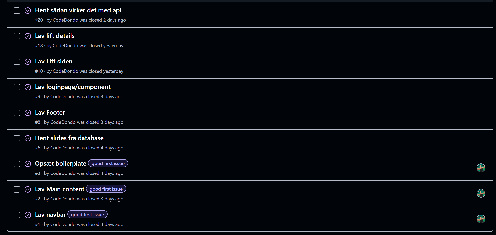
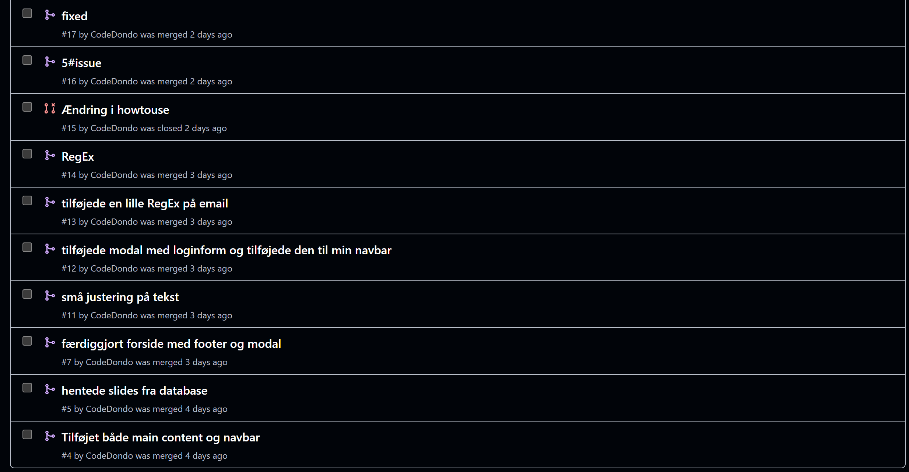

# WeGo Svendeprøve 2025

## Forside

Morten Redondo Winther, Hold nr. H1WE080124
[Githubrepository](https://github.com/CodeDondo/wego-frontend)

Login username: info@webudvikler.dk
Login password: password

---

## Indledning:

Jeg har fra den 15. september til og med den 19. september arbejdet med min svendeprøve - WeGo som er en hjemmeside, hvor man kan pendle til og fra med andre chauffører. På selve siden er der vejledning om hvordan man skal booke en rejse. I følge opgaven har jeg brugt frameworket React med node.js, og derudover brugt MySQL, Postman, SCSS, Javascript og forskellige NPM pakker til at bygge siden.

---

### Indholdsfortegnelse:

- Vurdering af egen indsats og gennemførelse af prøven
- Argumentation for de valg jeg har truffet
- Redegørelse for oprindelsen af de forskellige kodeelementer
- Fremhævelse af eventuelle særlige punkter til bedømmelse
- Konklusion
- Eventuelle bilag

---

### Vurdering af egen indsats og gennemførelse af prøven

Jeg har arbejdet fra cirka klokken 9 frem til 15.30 hver dag. I starten sætter jeg hele min boilerplate op med backend og det sker uden problemer. Desværre kommer der allerede komplikationer fra start og jeg bliver meget frustreret og begynder at haste tingene lidt. Jeg ville ønske jeg fra start måske begyndte gå væk fra problemet og så komme tilbage til det, da jeg ofte tænker klarere når jeg lige får samlet mig selv igen. Men alt i alt så har jeg formået at kunne fremvise et godt stykke arbejde ud fra de koder jeg har lavet og været meget stolt af den måde jeg har bygget det op på. Måske ville jeg have gjort noget anderledes som kunne gøre min kode mere effektiv, men alt i alt så er det en kode jeg kan stå inde for. Jeg havde også problemet med branching i selve github, det valgte jeg dernæst at gå fra. Jeg er ikke den store organisator indenfor github, når man snakker om 1 mands team. Derfor valgte jeg også bare at commit direkte til main fremefter.

### Argumentation for de valg jeg har truffet

Først tænkte jeg at jeg styler samtidig med at bygge koden op funktionsmæssigt. Men da jeg ikke er den bedste til at style, ændrede jeg strategien til først og fremmest at gå efter den funktionelle del og så tage styling til sidst, da jeg ved jeg er bedre til at bygge en kode funktionelt mæssigt. Da jeg f.eks. byggede navbaren har jeg leget lidt med useState for at ændre tilstands variabler til isMobile og isVisible, en kode jeg er stolt af, da den viser virkelig hvordan det er useState fungerer, blandt andet med virkning fra useEffect også, så siden blev lige pludselig meget lettere at gøre responsive fra mobile til desktop. De steder, hvor jeg måske har prioteret mindre er ikke fordi jeg ikke ved hvordan det laves, det er fordi jeg har prioteret tiden ud fra hvad jeg syntes det var realistisk at nå i bund - f.eks. at gøre LiftList og ListDetails færdig. I løbet af opgaven har jeg benyttet mig at nogle gode samtaler med andre medstuderende, når jeg har siddet fast eller set nogle af mine gamle koder igennem, hvilket har fungeret rigtig godt.

### Redegørelse for oprindelsen af de forskellige kodeelementer

De hovedsagelig kodeelementer der er inkluderet

- Frontend - React, scss og styled-components
I React har jeg brugt forskellige hooks samt custom hooks til blandt andet at gemme, opdatere og selv rendere siden. Jeg har taget CSS modules i brug for at bygge styling og strukture siden med det rigtige udseende. Jeg har benyttet mig af styled-components for også at vise, hvordan man bruger tagged template literals til at style sine components på.

- Backend - MySQL, .env
MySQL har været til at gemme mine tabeller og bruge dem ind i min frontend ved kald af API. Jeg har dog selv oprettet nogle .env 
`VITE_API_URL="http://localhost:4000/api" `
`VITE_IMAGE_URL="http://localhost:4000" ` 

De var meget nyttige i forhold til at skulle skrive hele stien selv, så benyttede jeg mig bare af import, når jeg skulle bruge dem. `
` const URL = `${import.meta.env.VITE_API_URL}/trips/${lift_id} `

### Fremhævelse af eventuelle særlige punkter til bedømmelse

Til eksamen vil jeg gerne forklare min opbygning af mit component HowToUse, og hvis vi kan nå det også tage login. Grunden til jeg har valgt disse er blandt andet fordi jeg synes de var nogle spændende koder at arbejde med, men også nyttige.

### Konklusion

Jeg synes svendeprøven har været udfordrende på den gode måde. Normalt er jeg en person der frygter eksamen rigtig meget, men jeg føler jeg virkelig har været i dybde med min kode også forståelsen af den og det har hjulpet mig med at kunne etablere siden på den måde jeg har set den i mit hovede. Det kan godt være stylingen ikke har været 100% den måde det skulle have set ud, men jeg kan mærke der også er plads til forbedring i fremtiden med hensyn til at lære noget nyt. Alt i alt en rigtig god opgave at udfordre sig selv på.

### Eventuelle bilag

Eksempler på issues

Eksempler på mine branches

